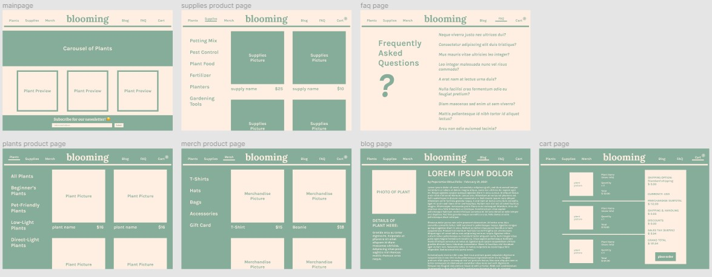

# blooming v.2

#### Jady Hom

[Github](https://github.com/jadyhome) | [LinkedIn](www.linkedin.com/in/jadyhom)

---

### Description

**_blooming_** is a mockup e-commerce website with a focus on selling plants, supplies, and merch.

**_blooming_** will also have a Blog page, FAQ page, as well as a Cart page.

Check out my deployed website here → [blooming](https://bloomingg.netlify.app/)

---

### Technologies Used

- HTML + CSS
- Javascript
- React
- Figma

---

### User Stories

- Users will see homepage/landing page.
- Users will be able to navigate between plants page, supplies page, merch page, FAQ page, Blog page, and shopping cart page.

---

### Wireframe

Initial Mockup/Wireframe

All Pages

---

### Future Updates

- [ ] Make it more mobile responsive
- [ ] Fix Carousel

---

### Credits

[Netlify](https://www.netlify.com/)

[Figma](https://www.figma.com)

[Pexels](https://www.pexels.com/)

- [@cottonbro](https://www.pexels.com/@cottonbro)
- [@corin](https://www.pexels.com/@corin)
- [@tharatip-sukee-294273](https://www.pexels.com/@tharatip-sukee-294273)
- [@minan1398](https://www.pexels.com/@minan1398)
- [@fotios-photos](https://www.pexels.com/@fotios-photos)
- [@gary-barnes](https://www.pexels.com/@gary-barnes)

[scroll-to-top](https://www.coderomeos.org/scroll-to-top-of-the-page-a-simple-react-component)